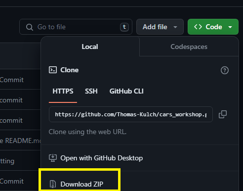
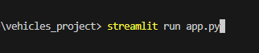
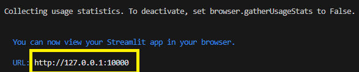

# CarMin - Used Vehicles Project

 
 In this project, I use a used cars inventory dataset to create some useful visualizations that can help with shopping for cars.

 This tool lets you filter the type of car you want and shows some visualizations and let's you compare types of cars available by the manufacturer.

 I utilize the pandas, plotly.express, and streamlit libraries to clean the dataset, create visualizations, and create a web app to display the final results.

 ###### Here is a link to the project: https://vehicles-project-wwdl.onrender.com

### Installation Instructions

To install and run this project on your local machine:

    1. Download the zip files

    2. Open the project folder in your IDE

    3. In a terminal, go to the project directory

    4. run the command "streamlit run app.py"

    5. Click on the local link path in the terminal output

### Troubleshooting

If you get an error with streamlit, make sure the installation path of streamlit is in your PATH environment variable before running.

###### Here's some instructions for how to edit the environment variable: https://www.java.com/en/download/help/path.html
